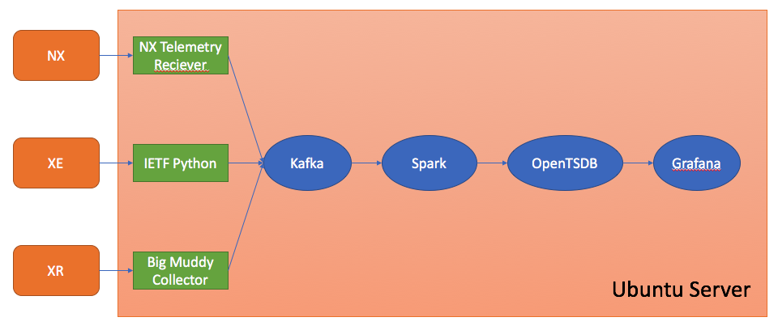

# Streaming Telemetry 101

In this tutorial you will learn how to configure streaming telemetry for IOS XE, as well as setup collectors, transform/load the data into a time series database, and visualize it using Grafana.

## The Environment
This environment consists of several virtualized devices and software components.

* [CSR 1000v](https://developer.cisco.com/docs/ios-xe/#!developer-tooling-quick-start-guide/virtual-ios-xe-device-options) (IOS XE)
* [IOS XRv](https://xrdocs.github.io/application-hosting/tutorials/iosxr-vagrant-quickstart) (IOS XR)
* [Cisco Nexus 9000v](https://developer.cisco.com/docs/nx-os/#!developer-tooling/developer-tooling) (NX-OS)
* Ubuntu Server

***Note:** Streaming Telemetry on IOS XRv and Cisco Nexus 9000v are outside the scope of Streaming Telemetry 101, but there for you to to develop around in the Sandbox. 

Running on the Ubuntu server are:

1. [NETCONF Client](https://github.com/CiscoDevNet/ncc) and [Pipeline](https://github.com/cisco/bigmuddy-network-telemetry-pipeline) (Consumers)
2. [Kafka](https://kafka.apache.org/) (Message Bus)
3. [Apache Spark](https://spark.apache.org/streaming/) with [Jupyter](http://jupyter.org/) (Transform the data into the time-series database format)
4. [OpenTSDB](http://opentsdb.net/) (Time series database)
5. [Grafana](https://grafana.com/) (Visualization)



## Start the Databases
**This step must happen first!** For this setup, we are using Apache Spark as the transformer/loader and OpenTSDB as the time series database. 

1. SSH into Ubuntu Server  
   ```bash
   # Password: Cisco1234!
   ssh telemetry@10.10.20.25
   ```

2. Download the latest code for the project

   ```bash
   cd telemetry_stacks
   git pull
   ```

   

1. Start the Docker Stacks from the directory `telemetry_stacks`

   ```bash
   docker-compose -f docker-compose.yml -f docker-compose-opentsdb.yml up -d
   ```

## Setting up Streaming Telemetry on IOS XE
IOS XE exposes streaming telemetry via NETCONF using [IETF YANG Push / YANG Datastore Subscription](https://datatracker.ietf.org/doc/draft-ietf-netconf-yang-push/). This is a draft RFC which Cisco has added support for in a fork of [ncclient](https://github.com/CiscoDevNet/ncclient) and developed useful wrappers for via [ncc](https://github.com/CiscoDevNet/ncc). It can be used like a script or programatically with Python. Due to being NETCONF based, only XML is supported in the encoding.

### Configure Streaming Telemetry

1. SSH into the CSR 1000v (IOS XE)  
   ```bash
   # Password: Cisco1234!
   ssh admin@10.10.20.30
   ```
2. Configure NETCONF-YANG and NETCONF  
   ```
   CSR1000V#conf t
   Enter configuration commands, one per line.  End with CNTL/Z.
   CSR1000V(config)#netconf-yang
   CSR1000V(config)#exit
   CSR1000V#
   ```

### Turn On Consumer
First we will ensure that we are able to stream data, then direct the data to our Kafka broker to be buffered until we are able to consume it into the database.

1. SSH into Server  
   ```bash
   # Password: Cisco1234!
   ssh telemetry@10.10.20.25
   ```
2. Verify we are able to stream data by printing it to stdout.  
   ```bash
   cd telemetry_stacks/consumers/xe/
   pipenv shell
   # Ctrl+C to halt
   python print_telemetry.py
   ```
   
   If everything is working, you should see an output of telemetry data in XML similar to:

   ```xml
   .
   .
   <datastore-contents-xml xmlns="urn:ietf:params:xml:ns:yang:ietf-yang-push">
     <interfaces-state xmlns="urn:ietf:params:xml:ns:yang:ietf-interfaces">
       <interface>
         <name>Control Plane</name>
         <statistics>
           <discontinuity-time>2018-05-31T14:49:17.000193+00:00</discontinuity-time>
           <in-octets>0</in-octets>
           <in-unicast-pkts>0</in-unicast-pkts>
           <in-broadcast-pkts>0</in-broadcast-pkts>
           <in-multicast-pkts>0</in-multicast-pkts>
           <in-discards>0</in-discards>
           <in-errors>0</in-errors>
           <in-unknown-protos>0</in-unknown-protos>
           <out-octets>0</out-octets>
           <out-unicast-pkts>0</out-unicast-pkts>
           <out-broadcast-pkts>0</out-broadcast-pkts>
           <out-multicast-pkts>0</out-multicast-pkts>
           <out-discards>0</out-discards>
           <out-errors>0</out-errors>
         </statistics>
       </interface>
   .
   .
   .
   ```

3. If everything is working, let's now send the data to Kafka. Instead of running `print_telemetry.py`, let's run `kafka_telemetry.py` in the background.  
  ```shell
  # All log statements will be in telemetry.log
  python kafka_telemetry.py &> telemetry.log &
  ```

#### Start the Transformer

1. Navigate to http://10.10.20:25:8888 in a browser, the password is `cisco1234`

2. Click on the folder [telemetry](http://10.10.20.25:8888/notebooks/telemetry/)

3. Click on the file [Kafka_OTSDB_XE.ipynb](http://10.10.20.25:8888/notebooks/telemetry/Kafka_OTSDB_XE.ipynb)

4. Click on the first tile, and click `run` on all the tiles but the last one that says `ssc.stop()`

   ** Make sure you do not click `run` on `ssc.stop`**

#### Create a Graph

1. Navigate to http://10.10.20.25:3000 in a browser, the login credentials are `admin`/`admin`.

2. Click on `Add Data Source` in the center of the screen.

3. Change the details to the following:

   ​	Name: `OTSDB`

   ​	Type: `OpenTSDB`

   ​	URL:  `http://opentsdb:4242`

4. Click on `Save & Test`, if everything is working you should see a green box stating "Data source is working"

5. Click on the `+` icon and create a new dashboard

6. Add a graph

7. Click on the panel and press `e` on your keyboard.

8. Change the `Metric` to `in-octets` and `Aggregator` to `last` and check the `Rate` checkbox

9. Click the refresh icon on the top right of the box, you should now see data!


## Conclusion

Now that you have Streaming Telemetry working on IOS-XE, try making it work with NX-OS and IOS-XR using the learning labs and other guides as reference. This environment is meant for you to be able to play around with the different Cisco operating systems and create your own collectors for databases you use in your environment. 